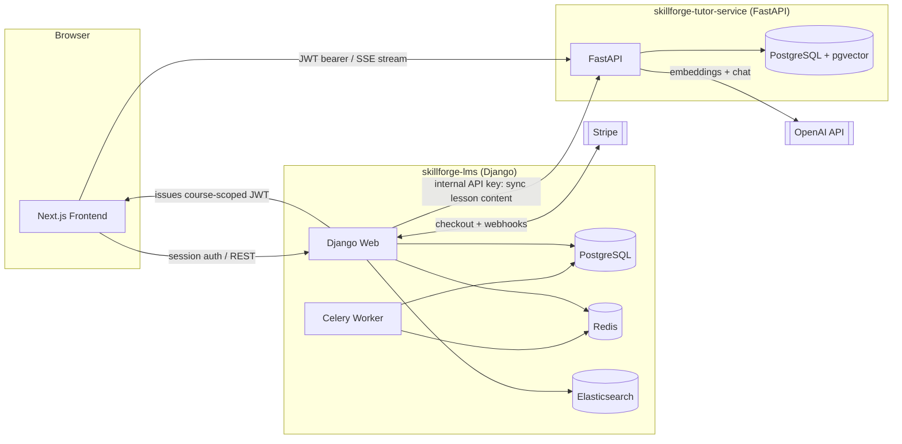

# SkillForge

**A production-style B2B corporate learning platform with a retrieval-augmented AI tutor, built to demonstrate real-world backend engineering: concurrency-safe data models, idempotent payment processing, multi-tenant isolation, and a genuine microservice extraction with a JWT trust boundary.**

This is not a tutorial project. Every architectural decision below was made deliberately, tested against a real failure scenario (a real duplicate webhook, a real cross-tenant access attempt, a real prompt-injection payload), and documented with the reasoning behind it.

---

## Table of Contents

- [Overview](#overview)
- [System Architecture](#system-architecture)
- [Tech Stack](#tech-stack)
- [Features](#features)
- [Engineering Highlights](#engineering-highlights)
- [Repository Structure](#repository-structure)
- [Getting Started](#getting-started)
- [Running Tests & Quality Checks](#running-tests--quality-checks)
- [API Overview](#api-overview)
- [Related Repositories](#related-repositories)
- [Known Limitations & Roadmap](#known-limitations--roadmap)

---

## Overview

SkillForge is a business-to-business e-learning platform. The workflow:

1. An **organization** (a company) subscribes and purchases a number of **seat licenses**.
2. The organization assigns seats to its **employees**.
3. Employees work through **courses** (structured into sections and lessons), take **quizzes**, and — once they've completed every lesson *and* passed the quiz — earn a **certificate**.
4. Each course has a **RAG-based AI tutor** employees can ask questions, grounded strictly in that course's content.
5. The organization has an **admin dashboard** showing employee progress, plus a downloadable **CSV compliance report**.

## System Architecture

The system is split into two independently deployable services, on purpose — not because the current scale requires it, but to demonstrate a genuine service boundary: separate codebases, separate databases, separate deployment lifecycles, connected only through explicit, authenticated HTTP contracts.



**Why two services instead of one?** The AI tutor has a fundamentally different load profile than the rest of the platform — LLM calls take seconds, everything else takes milliseconds. Running both under the same synchronous WSGI process risks a handful of concurrent tutor conversations blocking unrelated requests. The tutor service also needed to support real Server-Sent Events streaming, which requires an ASGI server (FastAPI/Uvicorn) rather than Django's default synchronous stack.

## Tech Stack

| Layer | Technology |
|---|---|
| Monolith backend | Django 6.0, Python 3.13 |
| Tutor microservice | FastAPI, SQLAlchemy, Alembic, Python 3.13 |
| Frontend | Next.js (App Router), TypeScript, Tailwind CSS |
| Primary database | PostgreSQL 16 |
| Vector database | PostgreSQL 16 + pgvector (tutor service, isolated instance) |
| Cache / task queue broker | Redis |
| Background jobs | Celery |
| Full-text search | Elasticsearch 8 |
| Payments | Stripe (Checkout + Webhooks) |
| AI / embeddings | OpenAI (`text-embedding-3-small`, `gpt-4o-mini`), LangChain |
| Auth (browser ↔ monolith) | Django session auth + CSRF |
| Auth (browser ↔ tutor service) | Short-lived, course-scoped JWT (HS256) |
| Auth (service ↔ service) | Shared internal API key |
| Containerization | Docker, Docker Compose |
| CI | GitHub Actions |
| Code quality | ruff (linting), mypy (type checking), import-linter (architecture boundaries) |
| Load testing | k6 |

## Features

### Identity & Organizations
- Custom, email-based user model (no username field).
- Organizations, seat licenses, and seat assignments with database-level concurrency safety (see [Engineering Highlights](#engineering-highlights)).
- Org-admin role with a dedicated dashboard and a downloadable compliance CSV report, protected against cross-organization access.

### Course Catalog & Learning
- Courses composed of ordered sections and lessons, with a draft → pending-review → published workflow enforced through a custom admin action.
- Quizzes with automatic, transactional scoring.
- Certificates rendered as real PDFs, issued asynchronously and gated on **both** finishing every lesson **and** passing the quiz — not one or the other.
- Full-text course search via Elasticsearch, including fuzzy matching for typos, with an automatic fallback to a plain database search if Elasticsearch is unreachable.
- Staff roles implemented with Django Groups, scoped to exactly the permissions each role needs.

### Payments
- Stripe Checkout integration for seat purchases.
- Signed, verified, idempotent webhook handling — duplicate events (including real re-delivered events) never double-process a payment or double-grant seats.
- A written refund policy (documented before any refund code was implemented) enforcing a 14-day window, immediate seat revocation, and permanent retention of already-issued certificates.
- Monetary values stored as integer cents, never floating-point, to avoid rounding errors.

### AI Tutor (Retrieval-Augmented Generation)
- Course content is chunked and embedded (OpenAI `text-embedding-3-small`), stored in pgvector, and retrieved by semantic similarity — not keyword matching.
- Four independent, tested safety guardrails:
  1. **Course isolation** — a learner can only query a course they're enrolled in.
  2. **Quiz-content exclusion** — quiz questions and answers are structurally never part of the indexed content, not filtered after the fact.
  3. **Prompt-injection resistance** — verified against a real hostile instruction planted inside lesson content.
  4. **Rate limiting** — a Redis-backed per-user cap on tutor questions per hour.
- Real-time response streaming via Server-Sent Events.
- Runs as an independently deployed FastAPI microservice, authenticated via a JWT that encodes exactly which course the token is valid for.

### Frontend
- Session-based login/logout with correct handling of Django's post-login CSRF token rotation.
- Live course search (debounced, with a visible "degraded mode" notice if search falls back from Elasticsearch).
- Streaming tutor chat UI with distinct handling for every documented error state (unauthenticated, not enrolled, rate-limited, empty question).
- Organization admin dashboard with seat usage, per-employee progress, and a compliance report download.

## Engineering Highlights

These are the details worth reading if you're evaluating this as a portfolio project rather than skimming the feature list.

- **Constraints over trust.** Seat capacity isn't just checked in application code — it's enforced with a `CHECK` constraint at the database level, so it holds even if a future code path forgets to validate it. This was deliberately tested by attempting to violate it directly from a database shell.
- **Race-condition-safe seat assignment.** Concurrent seat-assignment requests are serialized with `SELECT ... FOR UPDATE`, verified with a real multi-threaded test that fires two simultaneous requests for the last available seat and asserts exactly one succeeds.
- **Idempotent webhooks, not just theoretically.** Stripe's `event_id` is protected by a database `UNIQUE` constraint, and the fix was verified by replaying the *same real Stripe event* twice against a running instance — one `Payment` row, not two.
- **A written ADR before the code.** The refund policy was documented as an Architecture Decision Record *before* any refund logic was implemented, specifically to avoid ad-hoc decisions inside a webhook handler.
- **Tenant isolation with a real IDOR test suite.** A dedicated `for_org()` queryset is the only sanctioned way to fetch org-scoped data, and cross-tenant access is covered by tests that attempt to view another organization's dashboard and data — both at the API layer and, separately, through the live UI by editing the URL directly.
- **A genuine strangler-pattern extraction, not a rewrite.** The AI tutor was built inside the Django monolith first, proven working, and only then extracted into its own FastAPI service — with its own database, its own repository, and a JWT trust boundary that was verified by attempting to use a token issued for one course against a different course's endpoint (rejected, as intended).
- **Architecture boundaries enforced by tooling, not convention.** Seven `import-linter` contracts run in CI and fail the build if one Django app reaches into another's internals directly, rather than through its public service layer.
- **N+1 queries found and fixed with numbers, not guesses.** A dashboard endpoint's query count was measured (4 → 14 as employee count grew from 1 to 6), fixed with bulk-fetching and aggregation, re-measured (back to a flat 4), and locked in with an `assertNumQueries` test so it can't silently regress.
- **Deep health checks.** `/healthz` on both services verifies live connectivity to every real dependency (database, Redis) rather than just confirming the process is running — verified by stopping Redis and confirming the endpoint correctly reports `503`.

## Repository Structure

```
skillforge-lms/
├── accounts/          # Custom user model, session auth endpoints
├── orgs/               # Organizations, seat licensing, org-admin dashboard
├── catalog/            # Courses, sections, lessons, quizzes, search
├── learning/            # Enrollments, progress, quiz attempts, certificates
├── orders/             # Stripe checkout, webhooks, refunds
├── tutor/              # JWT issuance + content sync to the tutor service
├── config/             # Django settings, root URL configuration
├── frontend/           # Next.js application
├── docs/decisions/     # Architecture Decision Records
├── .github/workflows/  # CI pipeline
├── docker-compose.yml
├── Dockerfile
├── requirements.txt
└── requirements-dev.txt
```

The tutor microservice lives in a **separate repository** (see [Related Repositories](#related-repositories)) with its own structure:

```
skillforge-tutor-service/
├── app/
│   ├── main.py          # FastAPI app and routes
│   ├── auth.py          # JWT verification, internal API key check
│   ├── ingestion.py      # Chunking + embedding generation
│   ├── retrieval.py      # Semantic search
│   ├── chat.py            # Streaming chat completion
│   ├── models.py          # SQLAlchemy models
│   └── database.py
├── alembic/                # Database migrations
├── docker-compose.yml
├── Dockerfile
└── requirements.txt
```

## Getting Started

### Prerequisites

- Docker and Docker Compose
- Python 3.13
- Node.js 18+ and npm
- An OpenAI API key
- A Stripe account in test mode (only needed to exercise the payment flow)
- [Stripe CLI](https://docs.stripe.com/stripe-cli) (only needed to test webhooks locally)

### 1. Clone both repositories side by side

```bash
git clone https://github.com/aboodZahran44/skillforge-lms.git
git clone https://github.com/aboodZahran44/skillforge-tutor-service.git
```

They're independent services and are expected to run next to each other.

### 2. Configure environment variables

Copy `.env.example` to `.env` in **each** repository and fill in real values. The two services share two secrets that must match **exactly**: `JWT_SECRET_KEY` and `INTERNAL_API_KEY`.

**`skillforge-lms/.env`**
```
DJANGO_SECRET_KEY=...
STRIPE_SECRET_KEY=sk_test_...
STRIPE_PUBLISHABLE_KEY=pk_test_...
STRIPE_WEBHOOK_SECRET=whsec_...
OPENAI_API_KEY=sk-...
JWT_SECRET_KEY=<shared with tutor service>
INTERNAL_API_KEY=<shared with tutor service>
```

**`skillforge-tutor-service/.env`**
```
JWT_SECRET_KEY=<same value as above>
INTERNAL_API_KEY=<same value as above>
OPENAI_API_KEY=sk-...
```

### 3. Start the tutor service

```bash
cd skillforge-tutor-service
docker compose up -d --build
docker compose exec tutor-db psql -U postgres -d tutor_service -c "CREATE EXTENSION IF NOT EXISTS vector;"
alembic upgrade head
```

### 4. Start the monolith

```bash
cd skillforge-lms
docker compose up -d --build
docker compose exec web python manage.py migrate
docker compose exec web python manage.py seed_demo_data
docker compose exec web python manage.py createsuperuser
```

Django admin is now available at `http://localhost:8000/admin/`.

### 5. Start the frontend

```bash
cd skillforge-lms/frontend
npm install
npm run dev
```

The app is available at `http://localhost:3000`.

### 6. (Optional) Forward Stripe webhooks locally

```bash
stripe listen --forward-to localhost:8000/api/webhooks/stripe/
```

## Running Tests & Quality Checks

**Monolith (`skillforge-lms`):**
```bash
python manage.py test          # full automated test suite
ruff check .                   # linting
mypy .                          # type checking
lint-imports                   # architecture boundary enforcement
```

**Load test (requires the stack to be running):**
```bash
docker run --rm -v ${PWD}/loadtest:/scripts grafana/k6 run /scripts/catalog_search.js
```

Both repositories run the same checks automatically on every push via GitHub Actions.

## API Overview

| Method | Endpoint | Service | Notes |
|---|---|---|---|
| `GET` | `/api/auth/csrf/` | Django | Issues the CSRF cookie |
| `POST` | `/api/auth/login/` | Django | Session login |
| `POST` | `/api/auth/logout/` | Django | Session logout |
| `GET` | `/api/auth/me/` | Django | Current user |
| `GET` | `/api/courses/search` | Django | Fuzzy course search (Elasticsearch + fallback) |
| `POST` | `/admin/` course approval action | Django | Publishes a course and triggers content sync |
| `GET` | `/api/courses/<id>/tutor-token/` | Django | Issues a short-lived, course-scoped JWT |
| `GET` | `/api/orgs/<id>/dashboard/` | Django | Org-scoped employee progress |
| `GET` | `/api/orgs/<id>/compliance-report/` | Django | CSV export |
| `POST` | `/api/webhooks/stripe/` | Django | Signed Stripe webhook handler |
| `GET` | `/healthz/` | Django | Deep health check |
| `POST` | `/internal/lessons/ingest` | Tutor service | Content sync (internal API key) |
| `POST` | `/courses/<id>/chat` | Tutor service | SSE-streamed tutor response (JWT) |
| `GET` | `/healthz` | Tutor service | Deep health check |

## Related Repositories

- **Tutor microservice:** [skillforge-tutor-service](https://github.com/aboodZahran44/skillforge-tutor-service)

## Known Limitations & Roadmap

Documented honestly rather than hidden:

- Cloud deployment (originally scoped for AWS) was deliberately dropped from this project after evaluating the current AWS account/free-tier structure — the entire stack currently runs locally via Docker. This was a conscious scope decision, not an oversight.
- A few frontend screens (course enrollment flow, quiz-taking UI, certificate download) are not yet built, since their backend endpoints don't exist yet.
- Admin impersonation (support staff browsing as a specific user, with audit logging) is planned but not implemented.
- The Elasticsearch index currently rebuilds in place rather than using an alias-swap strategy for zero-downtime reindexing.
